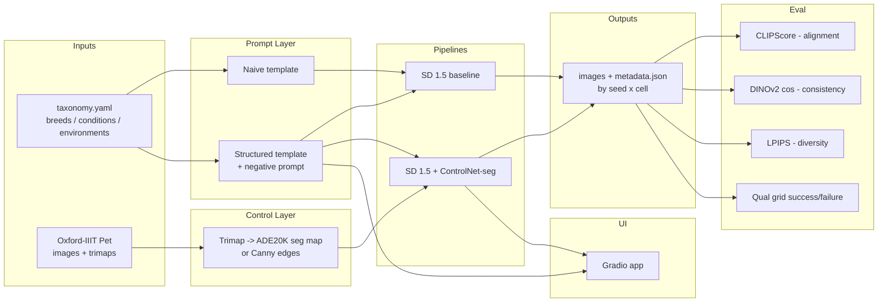

# Controlled Image Generation with Stable Diffusion — AI Animal Care

## Context

We're building a data-driven, controlled image generation system that turns structured veterinary/pet-care inputs (`animal_type`, `breed`, `condition`, `environment`) into **educational illustrations**. The submission requires a working pipeline, a control mechanism, a data-to-prompt mapping, quantitative evaluation with baseline-vs-improved comparison, failure analysis, a Gradio demo, a slide deck, and a video.

Locked decisions (from clarifying Qs):
- **Compute:** Google Colab Pro (T4/V100/A100). Mac M2 8GB is dev/editing only.
- **Base model:** `stable-diffusion-v1-5/stable-diffusion-v1-5` via `diffusers`.
- **Control stack:** Structured prompts + negative prompts + **ControlNet-seg** (`lllyasviel/control_v11p_sd15_seg`). Canny (`control_v11p_sd15_canny`) kept as a tested fallback if seg quality is weak with Oxford trimaps.
- **Dataset:** Oxford-IIIT Pet (37 breeds, trimap masks) via `torchvision.datasets.OxfordIIITPet`.
- **Conditions:** educational-only (cone collar, bandaged paw, grooming, dental check, vaccination scene, weight check, post-bath drying, health exam).
- **Demo:** Gradio app inside Colab.
- **Eval:** CLIPScore (alignment) + DINOv2 cosine (consistency/identity) + LPIPS (diversity) + curated success/failure grid.
- **Scope:** assignment-grade MVP (~1 week).

## Suggested upgrades over the raw brief

1. **Dual ControlNet path.** Ship seg as primary, canny as a switchable fallback — one flag, almost free, protects against seg-quality surprises from trimaps.
2. **Seed-paired generation.** For every (prompt, control) combo, reuse the same seed set so CLIP/DINO/LPIPS comparisons are apples-to-apples.
3. **Two-axis prompt ablation.** Naive vs structured × no-ControlNet vs ControlNet = 4 cells. Gives a clean 2×2 table for the deck instead of a single A/B.
4. **Taxonomy as YAML, not hardcoded.** Swap breeds/conditions/environments without touching code; graders and future-you both benefit.
5. **Every generation writes a `metadata.json` sidecar** (prompt, negative, seed, steps, cfg, controlnet model, source image, hashes). Makes failure analysis and the slide deck trivial.
6. **`CLAUDE.md` at the root** so every future Claude session picks up conventions, paths, and the tracker without re-deriving them.
7. **`TRACKER.md` with checkbox per phase + "last session note"** so this project resumes cleanly across agentic sessions.

Helpful community code/models to reuse (no re-invention):
- `diffusers` `StableDiffusionPipeline`, `StableDiffusionControlNetPipeline`.
- HF models: `stable-diffusion-v1-5/stable-diffusion-v1-5`, `lllyasviel/control_v11p_sd15_seg`, `lllyasviel/control_v11p_sd15_canny`.
- `torchvision.datasets.OxfordIIITPet` (handles download + trimaps).
- `transformers` `CLIPModel` / `CLIPProcessor` for CLIPScore.
- `torch.hub.load('facebookresearch/dinov2', 'dinov2_vitb14')` for identity embeddings.
- `torchmetrics.image.lpip.LearnedPerceptualImagePatchSimilarity` for LPIPS.
- `gradio` for the demo UI.

## Pipeline shape



2×2 ablation matrix the evaluator will fill:

```
                     | no-ControlNet | ControlNet-seg |
  naive prompt       |   cell A      |   cell B       |
  structured prompt  |   cell C      |   cell D       |  <- expected best
```

## Repository layout to create

```
repo/
├── README.md                      # overview, run instructions, samples, credits
├── CLAUDE.md                      # Claude's project brief (conventions, paths, tracker)
├── PLAN.md                        # copy of this plan
├── TRACKER.md                     # phase checklist + session log
├── requirements.txt               # pinned
├── .gitignore                     # outputs/, data/, *.ckpt, .ipynb_checkpoints
├── configs/
│   ├── taxonomy.yaml              # breeds, conditions, environments, style modifiers
│   ├── prompts.yaml               # naive + structured templates, negative prompt
│   └── generation.yaml            # SD params (steps, cfg, size, scheduler, seeds)
├── src/
│   ├── data/{dataset.py, taxonomy.py, masks.py}
│   ├── prompts/{templates.py, mapper.py}
│   ├── pipelines/{baseline.py, controlnet.py, loader.py}
│   ├── generation/{runner.py, io.py, seeds.py}
│   ├── evaluation/{clip_score.py, dino_sim.py, lpips_diversity.py, report.py}
│   └── app/gradio_app.py
├── notebooks/
│   ├── 01_data_exploration.ipynb
│   ├── 02_baseline_vs_structured.ipynb
│   ├── 03_controlnet_generation.ipynb
│   ├── 04_evaluation.ipynb
│   └── 05_demo_walkthrough.ipynb
├── scripts/
│   ├── download_data.py
│   └── generate_batch.py
├── docs/
│   ├── PROMPT_STRATEGY.md
│   ├── ETHICS.md
│   └── slides_outline.md
└── outputs/                       # gitignored; images + metadata.json per run
```

## Phased execution plan

### Phase 0 — Scaffold (0.5 day)
- Create folder tree above, `.gitignore`, `requirements.txt` pinning `diffusers`, `transformers`, `accelerate`, `torch`, `torchvision`, `safetensors`, `xformers`, `controlnet-aux`, `gradio`, `torchmetrics[image]`, `open_clip_torch`, `pyyaml`, `pillow`, `tqdm`, `matplotlib`.
- Write `CLAUDE.md` (paths, conventions, commands, tracker pointer).
- Copy this plan to `PLAN.md`; create `TRACKER.md` with one checkbox per phase + a "Last session note" section.
- Colab bootstrap cell documented in `notebooks/01_data_exploration.ipynb` (mount Drive, clone repo, pip install).

### Phase 1 — Data & taxonomy (0.5 day)
- `scripts/download_data.py`: `torchvision.datasets.OxfordIIITPet(root="data", download=True, target_types=["category","segmentation"])`.
- `src/data/dataset.py`: thin wrapper returning `(image, trimap, breed_name, species)`.
- `src/data/taxonomy.py`: loads `configs/taxonomy.yaml` — 37 breeds (auto from dataset), ~8 conditions, ~6 environments, ~4 style modifiers ("veterinary illustration", "educational diagram", etc.).
- `src/data/masks.py`: `trimap_to_seg_map(trimap, ade_class="animal")` mapping pet foreground to the ADE20K color used by ControlNet-seg; `image_to_canny(image)` via `controlnet_aux.CannyDetector` as fallback.
- Notebook 01: show 20 examples with breed + trimap + seg-map overlays; verifies mask quality end-to-end.

### Phase 2 — Prompt layer (0.5 day)
- `configs/prompts.yaml`:
  - `naive`: `"a {breed} {condition}"`.
  - `structured`: `"{style}, a photograph of a {breed} ({species}) {condition_clause}, {environment_clause}, soft studio lighting, shallow depth of field, high detail, 50mm"`.
  - `negative`: `"cartoon, blurry, lowres, deformed anatomy, extra limbs, watermark, text, disturbing, graphic injury, blood, gore"`.
- `src/prompts/templates.py`: render functions fed from YAML.
- `src/prompts/mapper.py`: `structured_input_to_prompt({animal_type, breed, condition, environment}) -> (positive, negative)`; documents strategy (slot-filling, clause library, style anchoring, ethics modifiers).
- `docs/PROMPT_STRATEGY.md`: writes up the strategy for the rubric.

### Phase 3 — Baseline SD 1.5 pipeline (0.5 day)
- `src/pipelines/loader.py`: lazy singletons for SD + ControlNets with `enable_attention_slicing` and `enable_xformers_memory_efficient_attention` for Colab T4.
- `src/pipelines/baseline.py`: `generate(prompt, negative, seed, steps=30, cfg=7.5, size=512) -> PIL.Image`.
- `src/generation/seeds.py`: deterministic seed grid so every cell of the 2×2 ablation uses the same seeds.
- `src/generation/io.py`: `save(image, meta: dict, out_dir)` writes `{idx:04d}.png` + `{idx:04d}.json`.
- Notebook 02: naive vs structured prompts on 10 (breed, condition, environment) triples × 4 seeds; qualitative grid.

### Phase 4 — ControlNet-seg pipeline (1 day)
- `src/pipelines/controlnet.py`: wraps `StableDiffusionControlNetPipeline` with seg and canny variants selectable by arg.
- `src/generation/runner.py`: runs the full 2×2 ablation over a curated set of N≈40 (breed, condition, environment) triples × K=4 seeds. Persists outputs to `outputs/{cell}/`.
- Quality gate: sanity-check a few outputs in notebook 03; if seg conditioning looks weak (common with single-class masks), auto-switch the primary to canny and record the decision in `TRACKER.md`.

### Phase 5 — Evaluation (1 day)
- `src/evaluation/clip_score.py`: CLIPScore per (image, prompt) using `openai/clip-vit-base-patch32`.
- `src/evaluation/dino_sim.py`: DINOv2 embeddings; **condition consistency** = cosine similarity across seeds for the same prompt; **breed identity** = cosine between generated image and a reference Oxford image of that breed.
- `src/evaluation/lpips_diversity.py`: mean pairwise LPIPS across seeds per prompt (higher = more diverse).
- `src/evaluation/report.py`: aggregates a pandas table with one row per cell, writes `outputs/eval/summary.csv` + a markdown grid for the deck; auto-picks top success and worst failure per cell.
- Notebook 04: tables + bar charts; write up findings for the deck.

### Phase 6 — Gradio demo (0.5 day)
- `src/app/gradio_app.py`: dropdowns for animal_type, breed, condition, environment; toggle for ControlNet on/off; slider for seed; renders 4 variations side-by-side with the resolved prompt shown. Disclaimer banner "AI-generated illustration — not a medical reference" pinned on top.
- Notebook 05: one-cell launcher with `share=True` for the video capture.

### Phase 7 — Deliverables (1 day)
- `README.md`: scenario, dataset, how to run in Colab, prompt strategy, sample grid, ethics, credits.
- `docs/slides_outline.md`: 12-slide outline mapped 1:1 to rubric (scenario, dataset, methodology, pipeline, prompt design, control, tools, results, demo link, GitHub, evaluation, findings + AI-tools disclosure).
- `docs/ETHICS.md`: AI-generated disclaimer, avoided categories, audit of failure cases.
- Record 90-second demo video from the Gradio app; link in README and slides.
- Final `TRACKER.md` update + push tag `v1.0-submission`.

## Phase tracker (seed for `TRACKER.md`)

```
# Project Tracker
Last session note: <free text — what ended, what's next>
Active phase: <id>

- [ ] Phase 0 — Scaffold
- [ ] Phase 1 — Data & taxonomy
- [ ] Phase 2 — Prompt layer
- [ ] Phase 3 — Baseline pipeline
- [ ] Phase 4 — ControlNet pipeline
- [ ] Phase 5 — Evaluation
- [ ] Phase 6 — Gradio demo
- [ ] Phase 7 — Deliverables
```

Convention: every session ends by updating `Last session note` and the active phase checkbox.

## CLAUDE.md shape (to be created in Phase 0)

Sections:
1. Project one-liner + scenario.
2. Locked decisions (bullet list from this plan — model, control, dataset, eval, scope).
3. Repo map (tree from above).
4. Run commands (Colab bootstrap, `python scripts/download_data.py`, `python scripts/generate_batch.py --cells all`, `python -m src.app.gradio_app`).
5. Conventions: YAML-first config; every image has a metadata sidecar; seeds come from `src/generation/seeds.py`; ethics disclaimer mandatory on any rendered UI.
6. Tracker pointer: "Always read and update `TRACKER.md` at session start/end."
7. Do-not-do list: no clinical/graphic imagery, no human medical advice, no real-person faces, don't commit `outputs/` or `data/`.
8. Pointers to `PLAN.md`, `docs/PROMPT_STRATEGY.md`, `docs/ETHICS.md`.

## Critical files the implementer will touch

- `configs/taxonomy.yaml`, `configs/prompts.yaml`, `configs/generation.yaml` — change behavior without touching code.
- `src/prompts/mapper.py` — the single source of truth for data→prompt.
- `src/pipelines/controlnet.py` — the control story.
- `src/generation/runner.py` — the 2×2 ablation entry point.
- `src/evaluation/report.py` — produces every number/grid that goes into the deck.
- `src/app/gradio_app.py` — the demo.

## Verification (end-to-end)

1. `python scripts/download_data.py` → `data/oxford-iiit-pet/` populated; notebook 01 renders 20 images + trimaps.
2. `python scripts/generate_batch.py --cells A,B,C,D --n-triples 4 --seeds 4` → produces 64 images across `outputs/{A,B,C,D}/` each with a `.json` sidecar.
3. `python -m src.evaluation.report --in outputs --out outputs/eval` → writes `summary.csv` showing structured+ControlNet (cell D) winning CLIPScore and DINOv2-consistency over naive baseline (cell A), with LPIPS staying > floor (diversity preserved).
4. `python -m src.app.gradio_app` → Gradio launches; picking (Golden Retriever, cone collar, home living room) produces 4 variants in < 60s on T4; disclaimer visible.
5. README "Quickstart" block, copied verbatim into a fresh Colab, reproduces step 4.

## Open questions I'm assuming "yes" on (flag if wrong)

- GitHub repo will stay public for submission; `outputs/` and `data/` are gitignored but a small `samples/` folder of ~12 curated PNGs is committed for the README.
- We can use Hugging Face Hub without a paid account (all referenced models are free).
- "Multiple variations per input" means 4 seeds per prompt — enough for LPIPS while keeping Colab runtime reasonable.