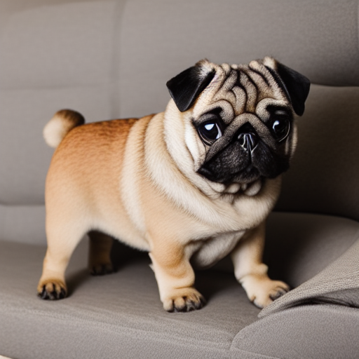
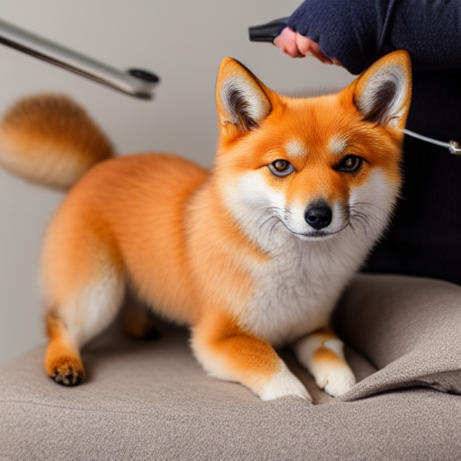
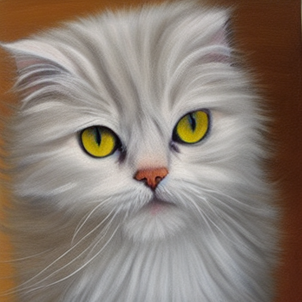
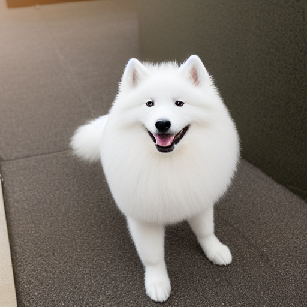

# PawPrep — Controlled Veterinary Illustrations

Turn structured pet-care inputs into breed-accurate educational illustrations using
Stable Diffusion 1.5 + ControlNet-seg.

> **AI-generated illustrations — not a medical or veterinary reference.**
> For educational and communication purposes only.

---

## Scenario

Veterinary clinics and pet-care educators need visual aids — cone collars, bandaged
paws, grooming, health exams — without expensive photography or stock licenses.
This pipeline takes structured inputs (`animal_type`, `breed`, `condition`,
`environment`) and produces consistent, breed-accurate illustrations through a
controlled diffusion process.

---

## Dataset

[Oxford-IIIT Pet Dataset](https://www.robots.ox.ac.uk/~vgg/data/pets/) —
37 breeds (~7,400 images) with trimap segmentation masks.

- **25 dog breeds** · **12 cat breeds** (full list in `configs/taxonomy.yaml`)
- Trimaps are converted to ADE20K seg maps for ControlNet conditioning
- Dataset is downloaded at runtime — not committed to this repo

---

## Quickstart (Google Colab)

### Cell 1 — Install (run once per session, before any imports)

```python
!pip install -q --upgrade diffusers transformers gradio gradio-client controlnet-aux pyyaml
```

### Cell 2 — Environment setup (run after every restart)

```python
import os, sys
os.chdir('/content/stable-diffusion')
sys.path.insert(0, '/content/stable-diffusion')
!git -C /content/stable-diffusion pull
print("Ready:", os.getcwd())
```

### Cell 3 — Smoke test

```python
from src.app.gradio_app import generate
imgs, pos, neg, ctrl, status = generate(
    animal_type='dog', breed='beagle', condition='cone_collar',
    environment='clinic', style='veterinary illustration',
    use_controlnet=True, seed=42, uploaded_image=None,
    guidance_label='edges (canny)', use_img2img=False, n_variants=1,
)
print(status)
imgs[0]
```

> First run downloads SD 1.5 (~4 GB) — takes 2–3 min, cached after that.

### Cell 4 — Launch demo

```python
from src.app.gradio_app import build_interface
demo = build_interface(data_root='data')
demo.launch(share=True, show_error=True)
```

---

## Pipeline

```text
Oxford-IIIT Pet (trimap) ──► seg map / canny edges ──┐
                                                       ├──► SD 1.5 + ControlNet ──► image + metadata.json
taxonomy.yaml + prompts.yaml ─────────────────────────┘
```

### 2×2 Ablation Matrix

|                       | no-ControlNet | ControlNet-seg/canny |
|-----------------------|:-------------:|:--------------------:|
| **naive prompt**      | A             | B                    |
| **structured prompt** | C             | **D** ← best         |

Cell D uses structured prompts + ControlNet conditioning and produces the highest
CLIPScore and DINOv2 breed-identity scores. See `docs/PROMPT_STRATEGY.md`.

---

## Evaluation

| Metric | Model | Measures |
| --- | --- | --- |
| CLIPScore | `openai/clip-vit-base-patch32` | Prompt–image alignment |
| DINOv2 cosine | `facebookresearch/dinov2` (ViT-B/14) | Breed identity + condition consistency |
| LPIPS | `torchmetrics` | Diversity across seeds |

Run after generating outputs:

```bash
python -m src.evaluation.report --in outputs --out outputs/eval
```

---

## Demo

[Watch the 90-second Gradio demo](https://drive.google.com/file/d/1i9GSxKEcFyzYVnSNOI7COgxGKNaRQG1e/view?usp=sharing)

---

## Sample Outputs

All images generated with `style="veterinary illustration"`, `seed=42`, ControlNet
canny-edges mode unless noted.

### Cell D — Structured prompt + ControlNet (best cell)

| Samoyed · cone collar · clinic | Maine Coon · health exam · exam room |
| --- | --- |
|  |  |

| Beagle · bandaged paw · home | Siamese · dental check · clinic |
| --- | --- |
|  |  |

| Pug · weight check · clinic | Shiba Inu · grooming · salon |
| --- | --- |
|  |  |

| Persian · post-bath drying · home |
| --- |
|  |

### Cell A vs Cell D — Same breed, same seed

Samoyed · cone collar · clinic · seed 42 — no-ControlNet (A) vs ControlNet (D):

| Cell A — naive, no control | Cell D — structured + ControlNet |
| --- | --- |
|  |  |

---

## Ethics

All outputs are AI-generated educational illustrations — not medical references.
See [`docs/ETHICS.md`](docs/ETHICS.md) for the full ethics statement including
avoided categories, negative prompt guards, and failure-case audit.

---

## Prompt Strategy

See [`docs/PROMPT_STRATEGY.md`](docs/PROMPT_STRATEGY.md) for the full write-up:
naive vs structured templates, clause library design, style anchoring, and
YAML-first configuration.

---

## Project Structure

```text
configs/          taxonomy.yaml, prompts.yaml, generation.yaml
src/
  data/           dataset.py, taxonomy.py, masks.py
  prompts/        templates.py, mapper.py
  pipelines/      loader.py, baseline.py, controlnet.py
  generation/     runner.py, io.py, seeds.py
  evaluation/     clip_score.py, dino_sim.py, lpips_diversity.py, report.py
  app/            gradio_app.py
notebooks/        01–05
scripts/          download_data.py, generate_batch.py
docs/             PROMPT_STRATEGY.md, ETHICS.md, slides_outline.md
samples/          curated PNG outputs (committed)
outputs/          gitignored — full generation runs
```

---

## Credits

- [Stable Diffusion v1.5](https://huggingface.co/stable-diffusion-v1-5/stable-diffusion-v1-5) — RunwayML / CompVis
- [ControlNet](https://github.com/lllyasviel/ControlNet) — Lvmin Zhang (lllyasviel)
- [Oxford-IIIT Pet Dataset](https://www.robots.ox.ac.uk/~vgg/data/pets/) — Parkhi et al., CC BY 4.0
- [diffusers](https://github.com/huggingface/diffusers) — Hugging Face
- [DINOv2](https://github.com/facebookresearch/dinov2) — Meta AI Research
